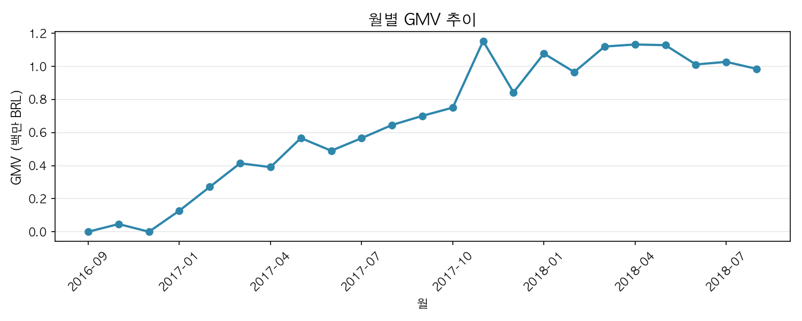
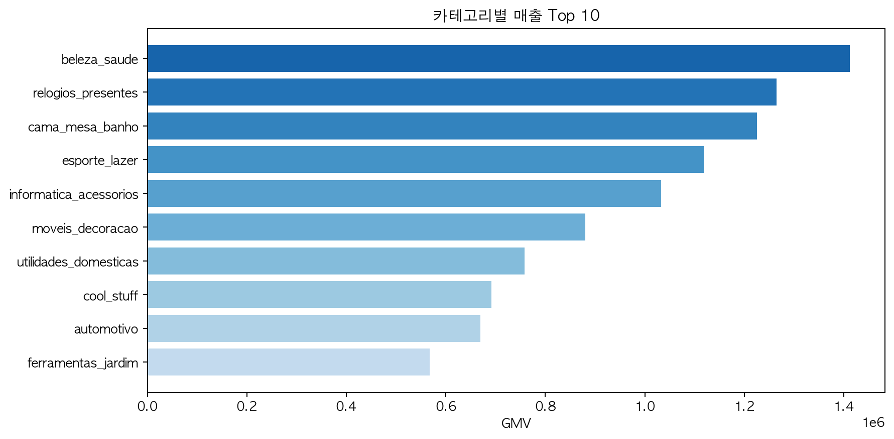
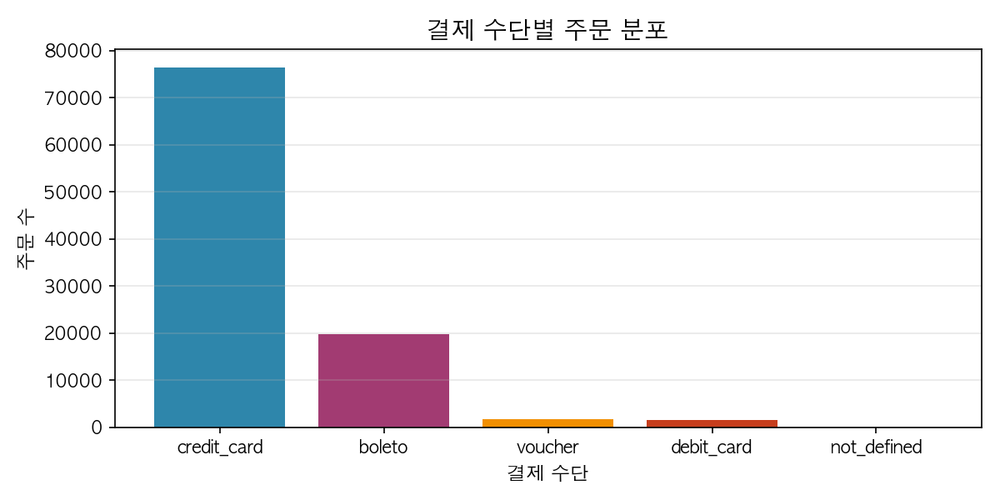

# Olist 브라질 이커머스 데이터 분석

주문·고객·결제 데이터를 활용한 SQL 기반 탐색 분석

📁 [SQL queries](/sql) · 📓 [EDA Notebook](/notebooks/eda_olist.ipynb) · 📊 [Visualizations](/images)

---

## 1. 분석 개요

Olist는 브라질의 온라인 마켓플레이스로, 2016년 9월부터 2018년 10월까지 약 99,000건의 주문 데이터가 공개되어 있다. 본 분석에서는 주문, 고객, 결제, 상품 테이블 간 관계를 활용하여 매출 구조, 고객 행동, 카테고리별 현황 등을 살펴보았다.

본 분석은 제한된 공개 데이터 환경을 고려하여, 주요 지표와 패턴을 중심으로 확인하는 수준에서 진행하였다. 실제 비즈니스 환경에서는 추가 데이터와 맥락 정보가 필요할 수 있다.

---

## 2. 핵심 분석 질문

### Q1. 매출 추이와 월별 패턴
전체 매출이 어떤 추이를 보이는지, 월별·요일별로 특이한 패턴이 관찰되는지 확인한다.



*월별 GMV 추이를 확인하기 위한 시각화*

### Q2. 재구매 고객 현황
전체 고객 중 2회 이상 구매한 고객 비중은 얼마인지, 재구매 고객과 단일 구매 고객 간 객단가 차이가 있는지 살펴본다.

### Q3. 카테고리별 매출 구성
매출 상위 카테고리는 무엇이며, 카테고리별 평균 객단가와 배송비 비중에 차이가 있는지 확인한다.



*카테고리별 매출 분포를 확인하기 위한 시각화*

### Q4. 지역별 고객 분포
고객이 집중된 주요 지역은 어디이며, 지역별 평균 주문 금액에 차이가 관찰되는지 살펴본다.

### Q5. 결제 수단별 현황
결제 수단에 따라 평균 주문 금액이나 할부 이용 횟수에 차이가 있는지 확인한다.



*결제 수단별 주문 분포를 확인하기 위한 시각화*

---

## 3. 확장 분석 (선택)

아래 질문은 핵심 분석 범위에 포함하지 않았으나, 추가 탐색이 필요할 경우 참고할 수 있다.

### Q6. 배송 지연과 리뷰 점수
예상 배송일 대비 실제 배송일의 차이가 리뷰 점수와 관련이 있는지 살펴본다.

> 본 분석은 상관관계를 확인하는 수준이며, 인과관계를 단정하지 않는다.

### Q7. 주문 취소 현황
주문 상태가 'canceled' 또는 'unavailable'인 주문의 비중과 분포를 확인한다.

---

## 4. 주요 지표 정의

| 질문 | 지표 | 계산 방식 |
|:-----|:-----|:----------|
| Q1 | 월별 GMV | `SUM(price + freight_value)` (배송 완료 기준) |
| Q1 | MoM 성장률 | `(당월 - 전월) / 전월 × 100` |
| Q2 | 재구매율 | `2회 이상 구매 고객 수 / 전체 고객 수 × 100` |
| Q2 | 평균 구매 주기 | 재구매 고객의 첫 구매~재구매 간 평균 일수 |
| Q3 | 카테고리별 매출 비중 | `카테고리 매출 / 전체 매출 × 100` |
| Q3 | 배송비 비중 | `카테고리 배송비 / 카테고리 매출 × 100` |
| Q4 | 지역별 고객 비중 | `해당 주 고객 수 / 전체 고객 수 × 100` |
| Q4 | 지역별 AOV | `해당 주 매출 / 해당 주 주문 수` |
| Q5 | 결제 수단별 AOV | `결제 수단별 주문 GMV 합계 / 해당 결제 수단 주문 수` (주요 결제 수단 기준) |
| Q5 | 평균 할부 횟수 | `AVG(payment_installments)` (신용카드) |

---

## 5. 분석 시 고려한 관점

### 5.1 지표 정의의 명확성
재구매율, AOV 등 지표를 사용할 때 분모와 분자를 명시하고, 취소 주문 제외 여부 등 조건을 함께 기술하였다.

### 5.2 분석 흐름의 구조화
전체 매출 추이를 먼저 확인한 뒤, 카테고리·지역·결제 수단 순으로 세분화하여 흐름이 자연스럽게 이어지도록 구성하였다.

### 5.3 쿼리 가독성
CTE를 활용하여 쿼리를 단계별로 분리하고, 의미 있는 별칭을 사용하여 리뷰 시 의도 파악이 용이하도록 작성하였다.

### 5.4 한계 인식
배송 지연과 리뷰 점수의 관계 등 해석에 주의가 필요한 부분에는 상관관계와 인과관계의 차이를 명시하였다. 공개 데이터의 특성상 일부 맥락 정보가 누락되어 있어, 현실 적용 시 추가 검증이 필요하다.

---

## 6. 데이터 소스

| 항목 | 내용 |
|:-----|:-----|
| Dataset | [Olist Brazilian E-Commerce (SQLite)](https://www.kaggle.com/datasets/terencicp/e-commerce-dataset-by-olist-as-an-sqlite-database) |
| 기간 | 2016년 9월 ~ 2018년 10월 |
| 규모 | 주문 약 99,000건 / 고객 약 99,000명 / 셀러 약 3,000개 / 카테고리 73개 |

---

## 7. 분석 시 적용된 가정

| 항목 | 가정 | 적용 쿼리 |
|:-----|:-----|:----------|
| 결제 수단 | 동일 주문에 여러 결제 수단 사용 시, 첫 번째 결제(`payment_sequential=1`)를 주요 결제 수단으로 간주 | Q5 |
| 카테고리별 주문수 | 동일 주문에 여러 카테고리 상품 포함 시, 각 카테고리에 개별 카운트 | Q3 |
| 카테고리별 AOV | (주문 × 카테고리) 조합 단위로 계산 | Q3 |
| SQLite 호환 | `LAG`, `SUM() OVER` 등 윈도우 함수 사용으로 SQLite 3.25.0+ 필요 | Q1~Q5 |

---

## 8. 테이블 관계

```
orders ─────┬──── order_items ──── products
            │          │
            │          └──── sellers
            │
            ├──── order_payments
            │
            ├──── order_reviews
            │
            └──── customers
```

---

## How to run

### 데이터 소스
[Kaggle Olist SQLite DB](https://www.kaggle.com/datasets/terencicp/e-commerce-dataset-by-olist-as-an-sqlite-database)에서 `olist.sqlite` 파일 다운로드

### 실행 환경
- Python 3.x
- Jupyter Notebook
- SQLite 3.25.0+ (윈도우 함수 지원 필요)

### 실행 순서 (SQL 분석)
1. SQLite DB 파일을 프로젝트 루트에 배치
2. DB 클라이언트에서 `olist.sqlite` 연결
3. `/sql` 폴더의 쿼리를 분석 질문 순서(Q1→Q5)에 따라 실행

### 실행 순서 (EDA Notebook)
1. `notebooks/` 폴더로 이동
2. `eda_olist.ipynb` 실행하여 데이터 탐색 및 시각화 확인

